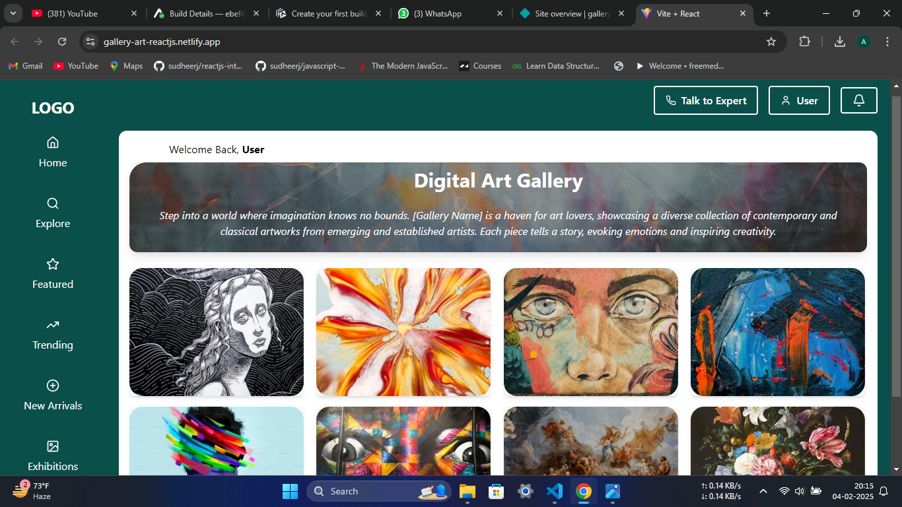

## Tech Stack
- **Frontend**: React.js
- **Styling**: Tailwind CSS
- **Icons**: Lucide React

---

## Screenshots


## Web View

Netlify - https://gallery-art-reactjs.netlify.app/



---

## Installation

### Prerequisites
Make sure you have the following installed:
- Node.js (v14 or higher)
- npm (or yarn)

### Steps
1. Clone the repository:
   ```bash
   git clone https://github.com/AmaaanAli/art-gallery.git
   ```
2. Navigate to the project directory:
   ```bash
   cd art-gallery
   ```
3. Install dependencies:
   ```bash
   npm install
   ```
4. Start the development server:
   ```bash
   npm run dev
   ```
   
---

## File Structure
```
src/
├── assets/
│   └── images/       # Gallery images
├── components/
│   ├── Button.jsx    # Button component
│   ├── NavItem.jsx   # Sidebar navigation item component
│   ├── Sidebar.jsx   # Sidebar component
│   ├── GallerySection.jsx  # Highlighted gallery section
│   └── ArtworkGrid.jsx      # Grid layout for artworks
├── pages/
│   └── DigitalArtGallery.jsx  # Main page layout
├── App.jsx           # Root application component
├── index.js          # Entry point
└── index.css         # Global styles (if any)
```

---

## Components

### Button
A reusable button component with support for:
- Icon rendering
- Outline and filled variants
- Text hiding (optional)

### NavItem
A reusable navigation item for the sidebar, with:
- Icon and label support
- Hover effects

### Sidebar
A vertical navigation bar containing:
- App logo
- Navigation items for Home, Explore, Featured, etc.

### GallerySection
A section to highlight the purpose and theme of the art gallery.

### ArtworkGrid
A responsive grid to display artwork images in a neat layout.

---

## Customization
- **Adding New Artworks**: Place new images in `src/assets/images/` and update the `ArtworkGrid.jsx` file.
- **Adding Navigation Links**: Update the `Sidebar.jsx` file with new `NavItem` components.
- **Changing Text**: Modify text content in `GallerySection.jsx` or other relevant components.

---

## Acknowledgments
- **Lucide React**: For providing beautiful and customizable icons.
- **Tailwind CSS**: For making styling fast and efficient.
- **React**: For enabling component-based development.

